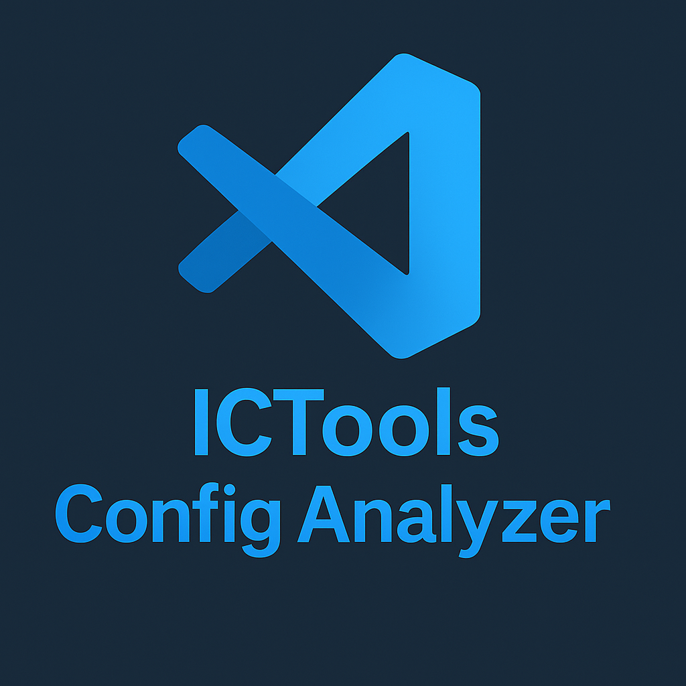
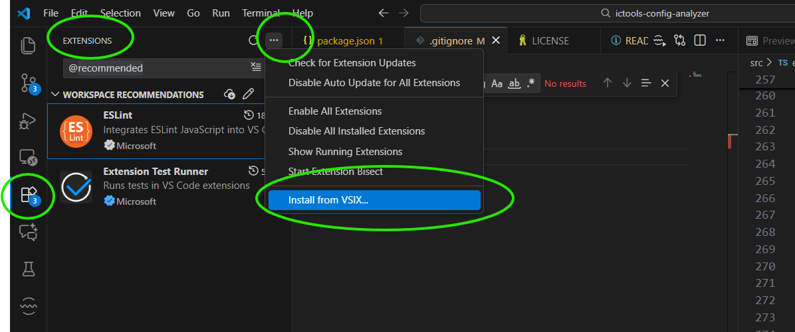
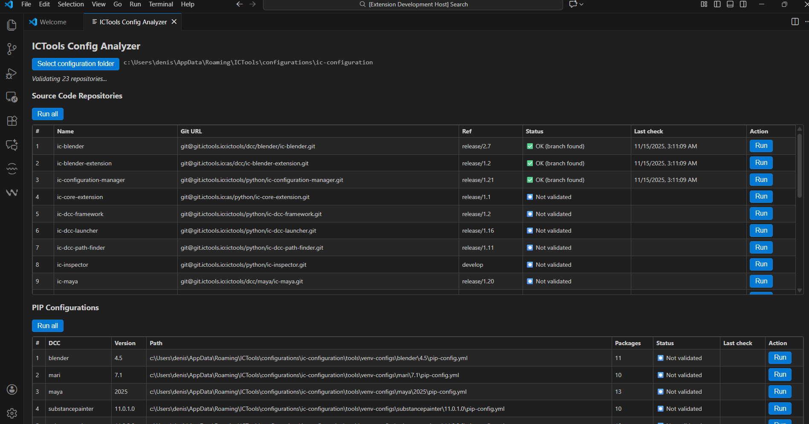

## 📦 Install the Extension Locally (VSIX File)

### ** Using VS Code UI**

1. Open **VS Code**
2. Go to the **Extensions** panel
3. Click the action menu (`⋯`) in the top-right corner
4. Select **“Install from VSIX…”**
5. Choose the file:

```
ictools-config-analyzer-0.0.1.vsix
```

📌 Screenshot example *(replace the image below with your own)*:

> 


## 🛡️ Release Notes

### 0.0.1
Initial version:
- Source Code validation
- Pip Config validation
- Basic Web UI


# ICTools Config Analyzer

Validate ICTools PIM configurations including:
- Source Code repositories
- Pip configuration files (`pip-config.yml`)
- Branch / tag existence and access permissions

This extension helps avoid time-consuming failures during environment setup by ensuring all configuration references are valid before installation.


---

## ✨ Features

- Check Git repository accessibility via SSH
- Validate branch, tag or ref existence
- Human-friendly validation status (emoji indicators)
- Manual validation per repository
- 🔄 **Run All** validations in batch (all or only failed)
- Timestamp display (ISO + humanized tooltip)
- Responsive webview UI built into VSCode

---

## 📸 UI Example

> *Validating repositories and pip configurations in progress*



---

## 🚀 Quick Usage

1️⃣ Open VSCode  
2️⃣ Press `Ctrl + Shift + P`  
3️⃣ Search: **`ICTools: Open Config Analyzer UI`**  
4️⃣ Run validations individually or using **Run All**

---

## ⚙️ Requirements

- `git` must be installed and authenticated (SSH recommended)
- Access to ICTools Git server for internal repositories

---

## 🔧 Extension Settings

None for now — coming soon 👀  

---

## 🏗️ Planned roadmap

| Feature | Status |
|--------|:-----:|
| Run All + progress | ✔ |
| Timestamp column | ✔ |
| Auto-discovery of config paths | ✔|
| Logs viewer | 🔄 Planned |

---

## 🧩 Commands

| Command | Title |
|---------|-------|
| `ictools-config-analyzer.openWebUI` | ICTools: Open Config Analyzer UI |

---

## 🛠️ Development

Clone repo, install deps and compile:

```bash
npm install
npm run compile
```

